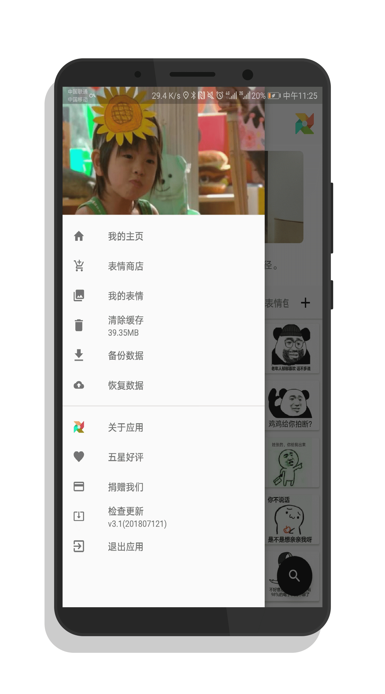
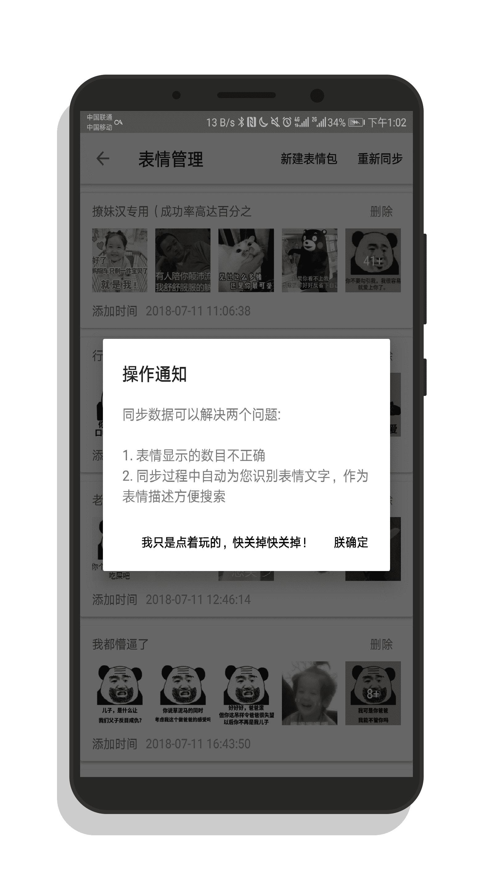
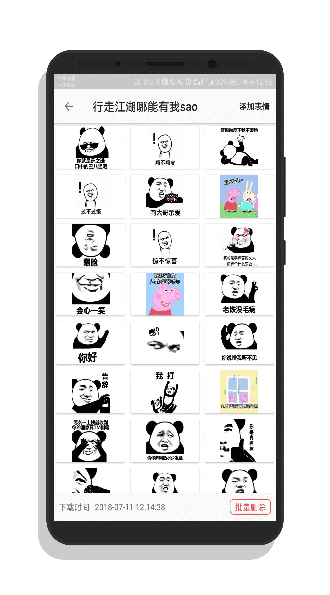
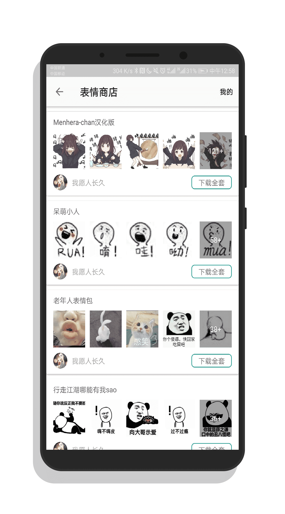
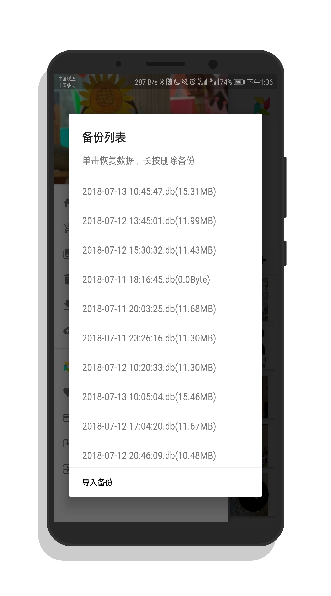
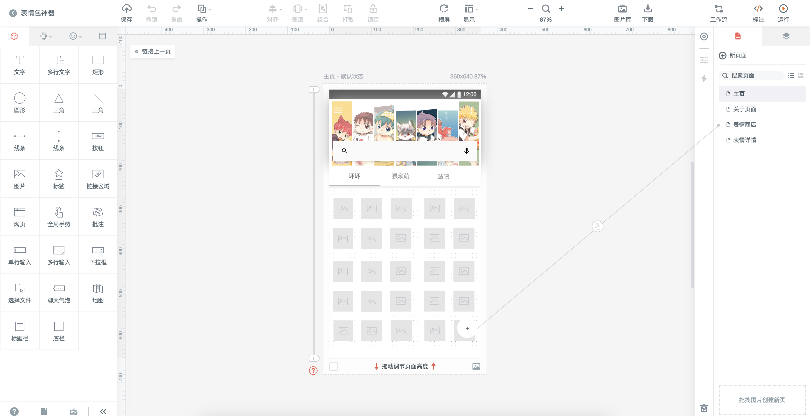
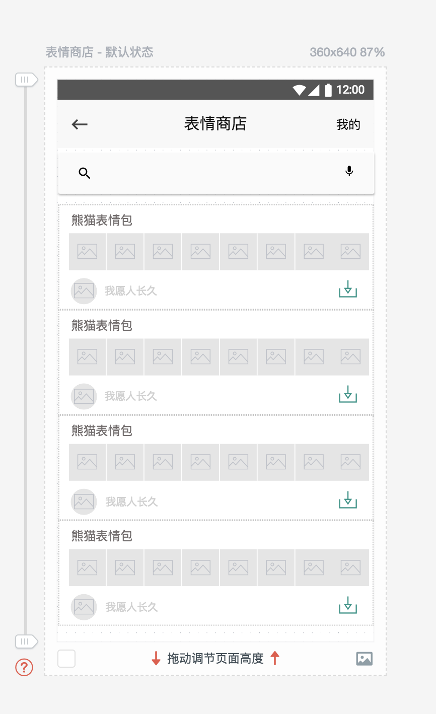
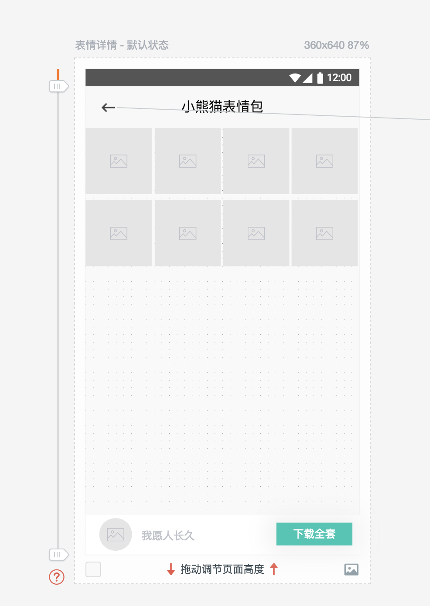
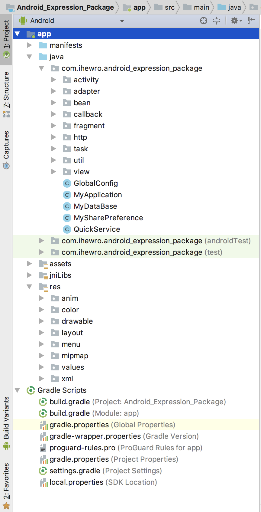

## 项目描述

本次生产实习中，我的项目名称为：表情宝宝（一款android的表情包管理软件）

为什么需要表情包管理软件？现在越来越多的人通过手机通讯方式聊天，而表情包则是为了补偿我们非面对面交流的身体信息，能够为我们聊天提供更多文字之外的信息，增加聊天的趣味性。

我们可以看到很多聊天工具都是逐渐的增加自己的表情商店，以供用户下载。但是这些表情包都有着趣味性不强或是不搞笑，所以很多人并没有真正的使用内置的表情商店。

很多人平时聊天发表情都是自己上网过程中随手保存的有趣的表情，然后聊天的时候的就轻松的发送出去。

## 需求分析

基于这些我掌握的这些信息，我开发的这款android 应用具有以下功能：

-   【极简设计】 material design 设计，界面简洁，无广告，权限极少，开源项目

-   【表情商店】 拒绝无趣的表情包，数据来自网络，不断更新

-   【表情管理】支持下载网络表情包，同样支持新建本地表情包，自己选择表情，制作合集

-   【表情备份】一个文件 = 所有表情数据，你可以在软件内随时备份，也可以将你的备份发给你的朋友

-   【一键分享】支持所有通讯工具的分享

-   【更有趣的】做了很多细节的处理，等你发现\~

## 成果展示

见下面几页的android 真机截图。










具体设计以及功能说明见第三节。

## 设计与实现

### 设计图

使用[墨刀]( <https://free.modao.cc/)> 在线设计了android
应用的界面。具体开发有些许改动。





### 开发环境

-   android studio 3.0
-   gradle 4.1 & gradle插件3.0.1
-   minSdkVersion 19
-   targetSdkVersion 26

### 开始设计

表情宝宝这款应用从开始设计到最终成果完成，中间经历了三次设计。

所以一开始就将需求完整的规划清楚是很有必要的。这在今后的工作要格外留心。

第一次设计，需求很简单。就是app内置一些表情包，分为不同的tab展示，然后用户可以下载，可以分享。

所以第一版本的应用，我把表情包图片存储到assets目录中，然后启动应用的时候，读取asset目录列表，使用tabLayout + viewpager + recyclerView显示数据。点击某个表情，会显示表情弹框，可以分享与下载。这里面的技术涉及到读取assets目录的文件，将字节流转换成图片显示在ImageView上面。

这实际上功能极少，内容是固定的，必须通过app升级才能获取到更多的表情包。于是开始第二次设计。

加入表情商店功能，将图片分成两种类型：

-   网络图片
-   本地图片

不再使用以前的apk内置图片的方式。

网络图片使用Glide框架加载，本地图片存储到sd卡的一个专有目录中。并维护一个数据库，用来存储本地图片的信息。这样每次打开app，无需扫描。

-   下载图片的时候，不仅把图片存储到本地，而且把图片信息存到数据库里。
-   删除图片的时候，不仅将本地图片删除，也把图片信息从数据库中移除、

而且写了一个[重新同步]的功能，该功能在数据库信息有错误的时候，可以手动执行重新同步功能，会重写扫描整个本地文件夹，重新写入数据库表情的信息。

这次设计仍然有这样几个问题：

1.  没有搜索功能，无法搜索
2.  无法备份，无法迁移数据
3.  用户不能自己新建表情包，没有添加自己本机的图片，只能下载我提供的网络图片，局限性还是很大

基于这两个问题，开始了我的第三次设计：

在数据库的表情表中增加des字段，用来存储表情的描述信息。调用百度识图的文字识别接口（每天15000次），下载的时候会自动识别图片文字，作为搜索依据。同样，用户也可以手动输入信息。

表情下载之后，文件不存储在本地文件夹，而是存储在数据库。没有错，将文件作为二进制存到数据库。第一次我很震惊，还有数据库存储二进制的操作，但这其实这是数据库存储由来已久的争论，图片存储在数据库中到底好不好？

好处很明显，只要备份数据库文件，就不怕文件丢失，任何时候都是恢复你的表情包文件。甚至你可以将你的数据库文件分享给你的好友，以便共享表情包。

但是由此会导致两个问题：

-   数据库很大，需要小心处理查询语句，大部分的查询不需要查询图片二进制字段，否则查询时间很忙
-   图片不能太大，否则数据库读取该字段会报错。所以，我使用了一个图片压缩的开源库，用户保存或者下载图片的时候，都会先压缩，然后再存储到数据库中，尽量避免读取保存的问题。

此外，用户可以自己新建表情包，并且可以在已有的表情包基础上添加表情。

第三次在第二次的基础上，仍然改动了很多内容。这部分在下面的开发过程中详细展开。

#### 开发过程

#### 数据库的设计与维护

数据库的操作使用的是github开源项目LitePel，一个通过面向对象的方法操作数据库，不需要写sql语句。

首先我需要哪些表：

-   ExpressionFolder：存放表情包目录信息
-   Expression：存放表情信息
-   OneDetailList：首页的图片列表信息
-   OneDetail：每一条图文的信息

比较复杂的操作如下：

-   重新同步数据库：这个功能希望在用户数据库数据损坏的时候，使用该功能能够修复数据库，使软件正常运行。所以完成的任务有
-   重新外键关联，对于表情的表情中每个数据，检查是否每个数据的外键是否为空，如果为空，再去查找表情包的表中的id，把外键重新关联。
-   自动识别文字：调用百度的接口，并把返回的数据保存到数据库。而且在获取的过程中由于接口不支持并发性，会有很大几率失败，失败后会重新获取数据的。
-   地址修正：因为我们表情文件并不是存到文件夹而是存到数据库中，如果本地文件不存在，则url置为空，否则才置为本地路径。
-   修正表情包的数目：表情包的数目可能某些操作导致错误，这里会重写计算表情的数据，然后重新赋值。

#### 网络接口的调用

此应用主要使用了三类接口：

-   一个是表情列表和表情详情

在应用设计的初期就没有打算做云同步和用户的注册登录以及自己搭建云上数据库。所以直接使用coding.net
提供的接口，只需我将文件夹和文件存储在仓库里，coding
开放平台提供一系列的文件接口获取仓库的信息，并以json格式返回，十分简单好用。速度还可以。我再返回的数据基础上再封装了一层以便android端更好的处理数据。

接口example：

<https://www.ihewro.com/exp/expFolderList.php?page=1&pageSize=10>

（获取所有的表情包列表，并且分页数目为10，返回第一页）

<https://www.ihewro.com/exp/expFolderDetail.php?dir=3509501&dirName=猥琐萌&page=1&pageSize=50>

（获取表情包id围3509501的表情列表，同样分页数据为50，返回第一页）

-   一个是每天的图片的文字接口（就是首页的图片+文字）

为了使app不仅仅是表情管理，而更有意思，我在首页增加了可刷新的图文显示。这里调用的是“韩寒监制”的app
[一个]使用的接口：*https://github.com/gongph/one-api*

同样在我的服务器上面封装了一层，返回当天的所有图文列表：

<https://www.ihewro.com/exp/one.php>

-   检查更新需要获取版本的最新版本号，我使用的是github提供的仓库信息接口，然后封装了一层：

<https://www.ihewro.com/exp/getAndroidLatestVersion.php?versionCode=1>

## 项目结构说明



-   activity：活动
-   adapter：数据适配器，主要是recyclerView 的适配器和ViewPager的适配器
-   bean：实体类，也包括数据库对象
-   callback：回调函数，与下面的task子线程搭配使用
-   fragment：碎片
-   http：接口，主要是retrofit的请求接口
-   task：子线程任务
-   util：一些公用的工具类
-   view：自定义组件
-   GlobalConfig：全局常量
-   MyApplication：继承于LitePalApplication

1.  开源库的使用

一款优秀的应用总是离不开各种开源库的支持。开源库能帮助减轻开发负担，更多的集中精力在逻辑处理而非界面组件的使用上。

这里列举该应用使用到的优秀开源项目：

```
*//百度文字识别*  
compile files(**'libs/ocr-sdk.jar'**)  

*//侧边栏*  
implementation(**"com.mikepenz:materialdrawer:6.0.7\@aar"**) {  
transitive = **true**  
}  

*//recyclerView*  
implementation **"com.android.support:recyclerview-v7:26.1.0"**  

*//简单修改状态栏，使其沉浸*  
compile **'com.jaeger.statusbarutil:library:1.5.0'**  

*//butterknife开源库，用于简化代码*  
compile **'com.jakewharton:butterknife:8.8.1'**  
annotationProcessor **'com.jakewharton:butterknife-compiler:8.8.1'**  

*//更方便的RecyclerView库*  
compile **'com.github.CymChad:BaseRecyclerViewAdapterHelper:2.9.36'**  

*//更好的日志打印工具*  
compile **'com.blankj:alog:1.8.0'**  

*//android图标*  
implementation **"com.mikepenz:iconics-core:3.0.3\@aar"**  
implementation **"com.mikepenz:iconics-views:3.0.3\@aar"**  
compile **'com.mikepenz:google-material-typeface:3.0.1.2.original\@aar'**
*//Google Material Icons*  

*//dialog*  
implementation **'com.afollestad.material-dialogs:core:0.9.6.0'**  
implementation **'com.afollestad.material-dialogs:commons:0.9.6.0'**  


*//图片加载框架*  
implementation **'com.github.bumptech.glide:glide:4.6.1'**  
annotationProcessor **'com.github.bumptech.glide:compiler:4.6.1'**  

*//网络请求*  
compile **'com.squareup.okhttp3:okhttp:3.9.0'**  
compile **'com.squareup.retrofit2:retrofit:2.3.0'**  
compile **'com.squareup.okhttp3:logging-interceptor:3.4.1'***//打印请求信息*  
compile **'com.squareup.retrofit2:converter-jackson:2.3.0'**  

*//toast*  
implementation **'com.github.GrenderG:Toasty:1.3.0'**  

*//简化运行时申请权限的代码*  
compile **'pub.devrel:easypermissions:1.0.1'**  

*//滚动布局的第三方框架*  
compile **'com.github.CymChad:BaseRecyclerViewAdapterHelper:2.9.36'**  
*//下拉刷新*  
compile **'com.scwang.smartrefresh:SmartRefreshLayout:1.1.0-alpha-7'**  
compile
**'com.scwang.smartrefresh:SmartRefreshHeader:1.1.0-alpha-7'***//没有使用特殊Header，可以不加这行*  

*//数据库操作*  
compile **'org.litepal.android:core:2.0.0'**  

*//进度条管理（真实进度）*  
implementation **'me.jessyan:progressmanager:1.5.0'**  

*//捐赠*  
compile **'com.canking.minipay:minipay:1.0.5'**  
compile **'cn.gavinliu.android.lib:ShapedImageView:0.8.5'**  

*//全局错误异常捕捉*  
compile **'cat.ereza:customactivityoncrash:2.2.0'**  

*//数据库监视*  
debugImplementation **'com.amitshekhar.android:debug-db:1.0.4'**  

compile **'org.greenrobot:eventbus:3.1.1'**  

*//图片选择器*  
compile **'com.zhihu.android:matisse:0.5.1'**  

*//图片压缩*  
compile **'id.zelory:compressor:2.1.0'**
```

2.  测试结果

-   通过android 4.4 以及android 7.1 以及 android8.0 真机测试
-   能够流畅正常的下载表情包，批量下载表情
-   能够新建本地的表情包，并且能够批量删除本地表情
-   能够备份数据，以及恢复数据
-   能够流畅的显示所有表情包
-   能够正常分享给所有支持的通讯工具

## 总结

开发有趣有用、界面优雅的应用是每个android开发者的追求。通过这次生产实习，认识到了对android的学习还远远不过，了解的也只是皮毛而已。

有以下几点体会：

1.  项目开始时候，将需求制定完整，而是昨晚之后再去改需求，这样需要变动的代码很多，很浪费时间。
2.  增强自己的调试能力。开发过程中也越来越多的使用android studio自带的调试功能，而不再是简单使用log输出排错。
3.  模块化代码：之前android的设计模式有一点点了解，虽然这次开发仍然使用的是mvc模型，很多界面数据显示和具体的逻辑混杂在一起，但是也写了一些接口来将数据处理与UI界面的变化分离开来，这样也便于数据处理模块的复用。
4.  线程的控制：子线程的使用不够好。比较常用的是AsyncTask，但是对其他的线程控制方法了解不够，需要做些总结。
5.  动画的使用：动画的使用能增强应用的流畅度和用户体验，对动画的了解不够。

这次生产实习也只是我的android之路的一个开始，学习了很多，感谢老师。

## 相关下载

-   github（源码托管）： <https://github.com/ihewro/Android_Expression_Package>
-   apk下载：<https://www.pgyer.com/emojibaby>
-   酷安下载（审核中）：<https://www.coolapk.com/apk/192401>
-   博客介绍页面：<https://www.ihewro.com/archives/758/>
